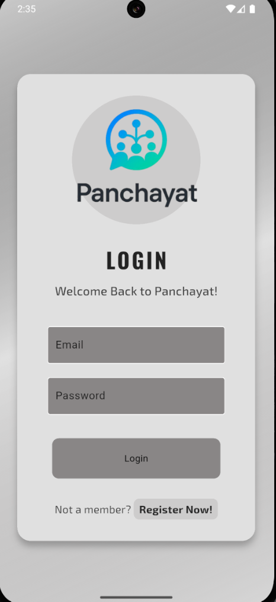
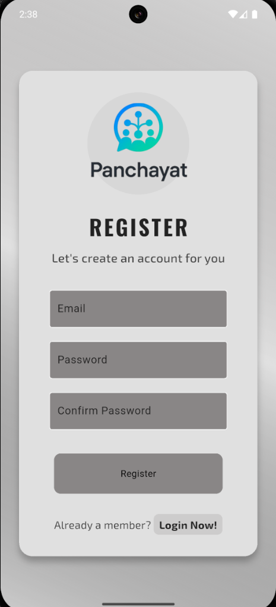
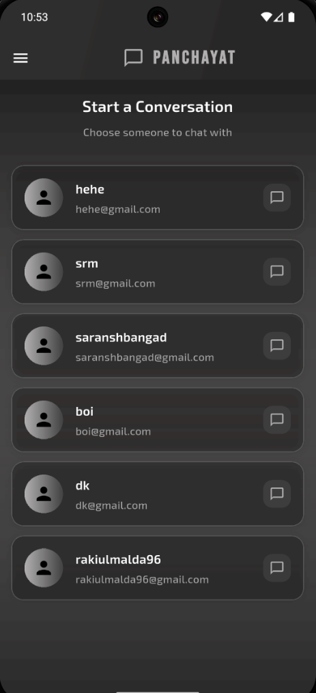
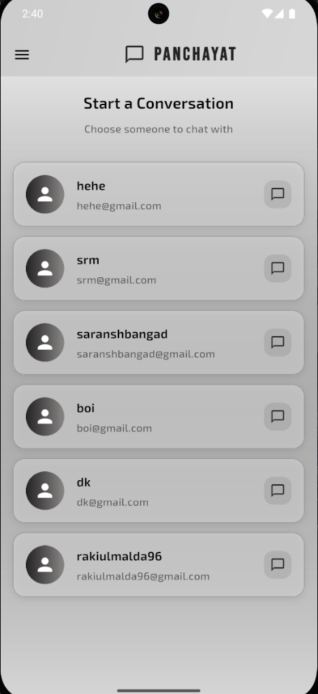
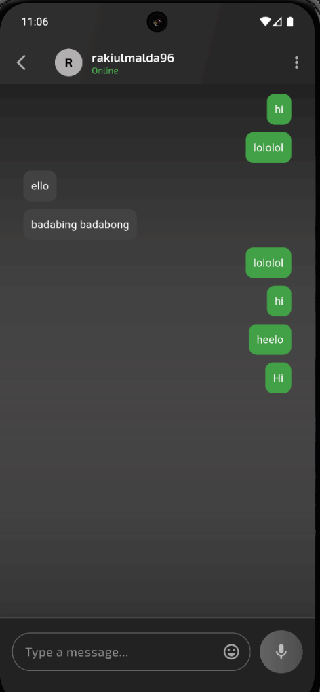
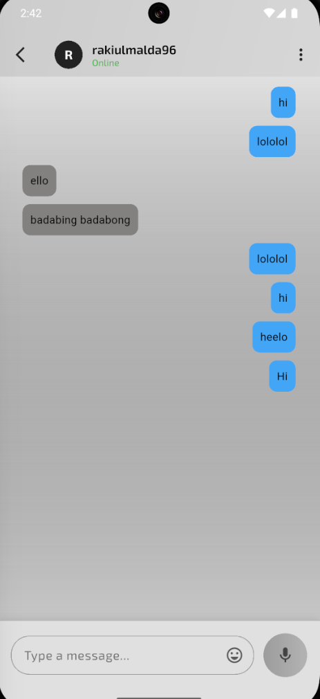
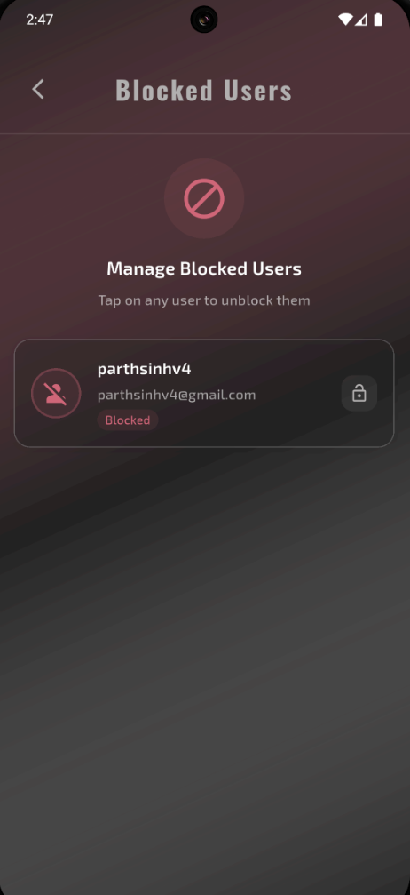
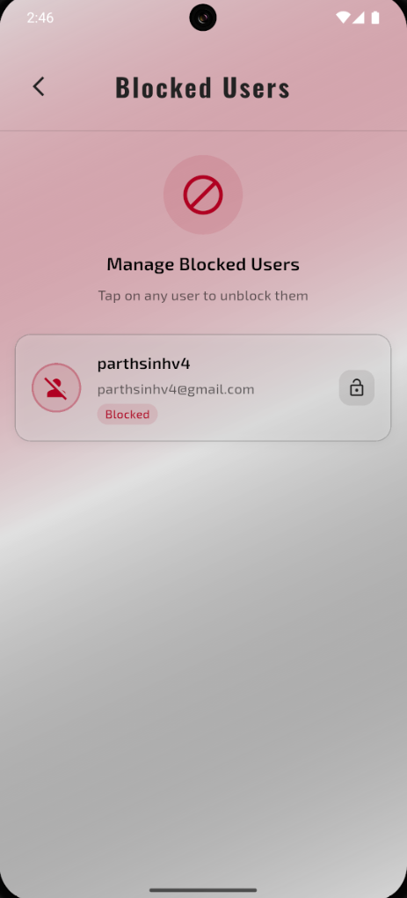
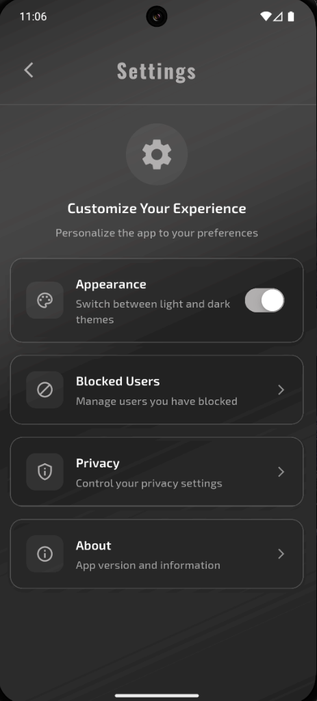

<div align="center">


</div>


<div align="center">


**A modern, feature-rich chat application built with Flutter and Firebase**

[Features](#-features) • [Screenshots](#-screenshots) • [Installation](#-installation) • [Usage](#-usage) • [Architecture](#-architecture) • [Contributing](#-contributing)

</div>

---

## 📋 Overview

Panchayat is a open-world chat application that brings people together through seamless communication. Built with Flutter and powered by Firebase, it offers a comprehensive set of features for modern messaging needs while maintaining a clean, intuitive user interface.

## ✨ Features

### 🔐 Authentication & Security
- **Email Authentication** - Secure login and registration system
- **User Session Management** - Automatic session handling
- **Data Privacy** - All user data securely stored in Firebase

### 💬 Messaging
- **Real-time Chat** - Instant messaging with live updates
- **Message Status** - Delivery and read receipts
- **Chat History** - Persistent message storage
- **User Presence** - Online/offline status indicators

### 👥 User Management
- **Contact Management** - Easy user discovery and connection
- **Block/Unblock Users** - Privacy control and user safety
- **User Profiles** - Personalized user information display

### 🎨 User Interface
- **Material Design 3** - Modern, consistent UI components
- **Dark/Light Mode** - Adaptive themes for user preference
- **Smooth Animations** - Polished user experience with fluid transitions
- **Google Fonts Integration** - Beautiful typography with Exo2 and Oswald fonts
- **Responsive Design** - Optimized for different screen sizes

### 🛡️ Safety & Moderation
- **Message Reporting** - Community safety features
- **User Blocking** - Privacy and harassment protection
- **Content Moderation** - Safe communication environment

## 📱 Screenshots

<div align="center">

### 🏠 Login and Register Page

&nbsp&nbsp


### 🏠 Home Page

&nbsp&nbsp


### 💬 Chat Interface  

&nbsp&nbsp


### ⚙️ Block Feature

&nbsp&nbsp



### ⚙️ Settings & Customization

&nbsp&nbsp


</div>

---

## 🚀 Installation

### Prerequisites

- Flutter SDK (≥3.5.3)
- Dart SDK (≥3.5.3)
- Android Studio / VS Code
- Firebase project setup

### Setup Instructions

1. **Clone the repository**
   ```bash
   git clone https://github.com/DKSingh1604/Panchayat.git
   cd Panchayat
   ```

2. **Install dependencies**
   ```bash
   flutter pub get
   ```

3. **Firebase Configuration**
   - Create a new Firebase project at [Firebase Console](https://console.firebase.google.com/)
   - Enable Authentication (Email/Password provider)
   - Enable Cloud Firestore
   - Download and add configuration files:
     - `google-services.json` for Android (place in `android/app/`)
     - `GoogleService-Info.plist` for iOS (place in `ios/Runner/`)

4. **Run the application**
   ```bash
   flutter run
   ```

## 🏗️ Architecture

### Project Structure
```
lib/
├── components/          # Reusable UI components
│   ├── chat_bubble.dart
│   ├── my_button.dart
│   ├── my_drawer.dart
│   ├── my_textfield.dart
│   └── user_tile.dart
├── models/              # Data models
│   └── message.dart
├── pages/               # App screens
│   ├── blocked_users_page.dart
│   ├── chat_page.dart
│   ├── home_page.dart
│   ├── login_page.dart
│   ├── register_page.dart
│   └── settings_page.dart
├── services/            # Business logic & API calls
│   ├── auth/           # Authentication services
│   └── chat/           # Chat & messaging services
├── themes/              # App theming
│   ├── dark_mode.dart
│   ├── light_mode.dart
│   └── theme_provider.dart
└── main.dart           # App entry point
```

### Key Technologies

- **Frontend:** Flutter (Dart)
- **Backend:** Firebase (Authentication, Firestore)
- **State Management:** Provider Pattern
- **UI Library:** Material Design 3
- **Typography:** Google Fonts
- **Real-time Database:** Cloud Firestore

## 🔧 Configuration

### Firebase Rules

Ensure your Firestore security rules are properly configured:

```javascript
rules_version = '2';
service cloud.firestore {
  match /databases/{database}/documents {
    // Users can read/write their own data
    match /Users/{userId} {
      allow read, write: if request.auth != null && request.auth.uid == userId;
    }
    
    // Messages are readable by participants
    match /Messages/{messageId} {
      allow read, write: if request.auth != null;
    }
  }
}
```

## 🎯 Usage

1. **Registration:** Create a new account with email and password
2. **Login:** Access your account securely
3. **Discover Users:** Browse available users for conversation
4. **Start Chatting:** Send real-time messages
5. **Customize Experience:** Switch between light/dark themes
6. **Manage Privacy:** Block/unblock users as needed

## 🤝 Contributing

We welcome contributions! Please follow these steps:

1. Fork the repository
2. Create a feature branch (`git checkout -b feature/AmazingFeature`)
3. Commit your changes (`git commit -m 'Add some AmazingFeature'`)
4. Push to the branch (`git push origin feature/AmazingFeature`)
5. Open a Pull Request

### Development Guidelines

- Follow Flutter's style guide
- Write meaningful commit messages
- Add documentation for new features
- Test your changes thoroughly

## 📄 License

This project is licensed under the MIT License - see the [LICENSE](LICENSE) file for details.

## 👨‍💻 Author

**DKSingh1604**
- GitHub: [@DKSingh1604](https://github.com/DKSingh1604)

## 🙏 Acknowledgments

- Flutter team for the amazing framework
- Firebase for reliable backend services
- Material Design team for design guidelines
- Google Fonts for beautiful typography

## 📞 Support

If you have any questions or need help, please:
- Open an issue on GitHub
- Check the [Flutter documentation](https://flutter.dev/docs)
- Visit [Firebase documentation](https://firebase.google.com/docs)

---

<div align="center">

**Made with ❤️ using Flutter**

</div>

